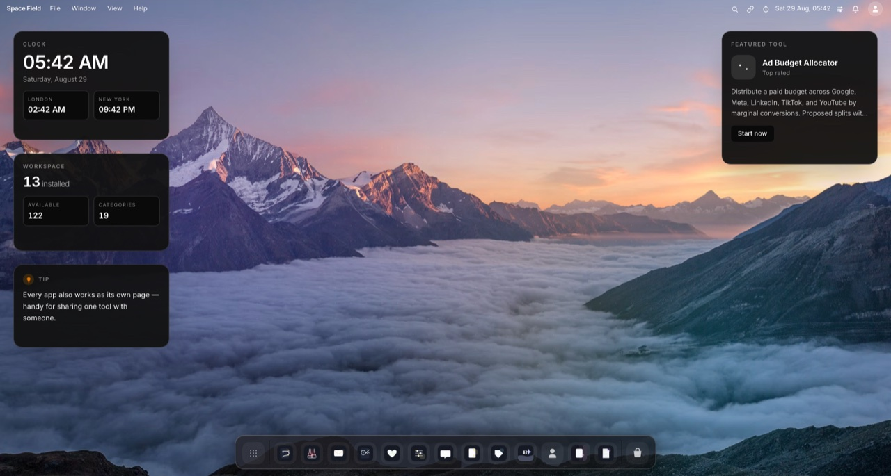
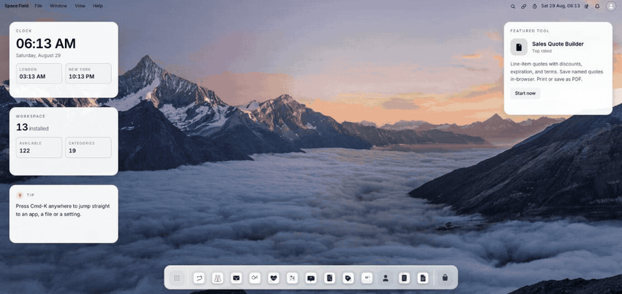
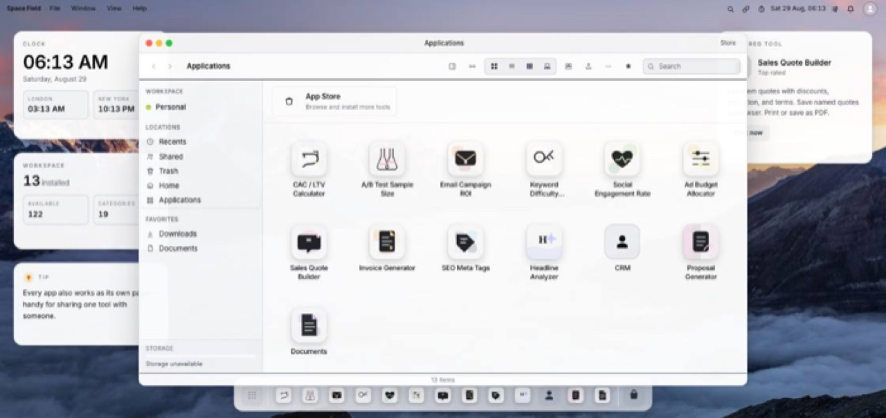
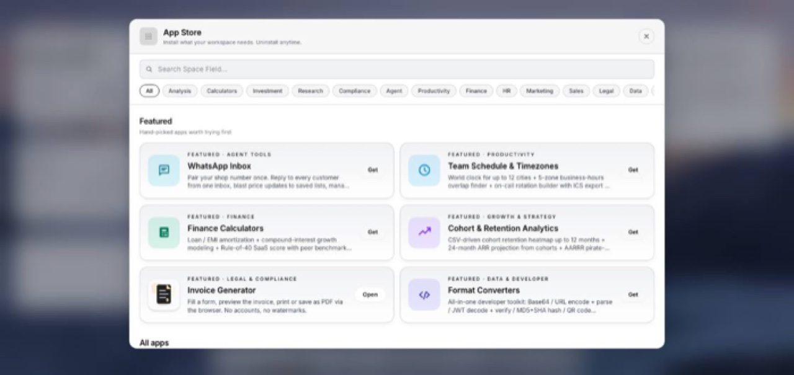

<div align="center">

# Spacefield

**A desktop operating system that runs in a browser tab.**

Draggable windows, a dock, a launchpad, multiple workspaces — and 126 apps that run inside them.
Free to use, fork and sell.

[](LICENSE)
[](https://nextjs.org)
[](https://react.dev)
[](#run-your-own)

[spacefield.co](https://spacefield.co) · [Quick start](#quick-start) · [What's inside](#whats-inside) · [Add your own app](#add-your-own-app)



</div>

---

## See it work

Opening the launchpad, browsing the app store, and launching an app — all inside one browser tab.

<div align="center">
  
</div>

---

## What it is

Not a website styled to look like a desktop. A **real window manager**, with real
applications mounted inside it — no iframes. Every app is a React component, so it
opens instantly and shares state with the rest of the workspace.

|  |  |
|---|---|
| **Windows and a dock** | Drag, resize, minimise and stack. A launchpad, a command palette, wallpapers, light and dark themes. |
| **Many workspaces** | Separate desktops with their own installed apps and state, so work and side projects never bleed into each other. |
| **Apps, not pages** | Every tool runs in a window *and* works as its own page — shareable, linkable, indexable. |
| **Yours to change** | Add an app by dropping a component in a folder and naming it in the registry. |

### The app store

Install and uninstall apps per workspace. 126 of them ship in the box.



### Your installed apps



---

## Quick start

You need [Node.js](https://nodejs.org) and a free [Supabase](https://supabase.com) project.

```bash
git clone https://github.com/asadev/spacefield.git
cd spacefield
npm install
cp .env.example .env.local     # add your three Supabase values
npm run dev                    # http://localhost:3000
```

Then apply the database schema:

```bash
npx supabase link --project-ref <your-project-ref>
npx supabase db push
```

That's it. Every other setting in `.env.example` is optional — leave a key blank and
the feature it powers stays switched off rather than breaking. Only the three
Supabase values are needed to boot.

---

## What's inside

| | |
|---|---|
| **126** | apps and tools |
| **284** | API routes |
| **103** | database migrations |
| **76** | admin sections |

**The apps** — a CRM, files, tasks, notes, projects, people, an inbox, calculators,
content and SEO tools, converters, and a WhatsApp inbox.

**The admin panel** — users, roles and permissions, feature flags, runtime config,
workflows, custom pages, audit logs.

**The plumbing** — row-level security on every table holding user data, full-text and
vector search, a public REST API, CSV import and export, PWA support, right-to-left
languages.

**Industry presets** — sixteen starter sets (agency, retail, salon, gym, clinic,
hospitality and more), each installing a fitting selection of apps. General-purpose
by default; the presets are opt-in.

---

## Architecture

```
app/page.tsx                    root route — mounts the desktop
app/tools/_components/          the workspace shell and window manager
app/tools/<slug>/_app.tsx       an app, mounted inside a window
app/tools/<slug>/page.tsx       the same tool as a standalone page
app/tools/_data/tools-list.ts   the registry — add your app here
app/admin/                      admin panel
supabase/migrations/            database schema
```

### Add your own app

1. Create `app/tools/<your-slug>/_app.tsx` — a normal React component.
2. Register it in `app/tools/_data/tools-list.ts` with a name, category and icon.
3. Optionally add `app/tools/<your-slug>/page.tsx` so it also works as a standalone page.

The dock, launchpad, search and sitemap pick it up from the registry automatically.

---

## Scripts

```bash
npm run dev            # development server
npm run build          # production build
npm run lint           # eslint
npm run test           # unit tests
npm run test:e2e       # playwright
```

> **Note:** the build script uses `next build --webpack` deliberately. Turbopack has an
> unresolved regression with this codebase.

---

## Self-hosting

Deploys to any host that runs Next.js. Two things to know on a free Vercel account:
scheduled jobs only run once a day, and the build container has 8 GB of memory — this
is a large app, so `productionBrowserSourceMaps` is left off to keep the build inside it.

---

## Contributing

Issues and pull requests are welcome — see [CONTRIBUTING.md](CONTRIBUTING.md).
Security reports go through [SECURITY.md](SECURITY.md), not the public tracker.

## Licence

MIT — see [LICENSE](LICENSE). Copyright © 2026 Asad Iqbal.

Use it, fork it, sell it. No attribution required beyond keeping the licence notice.
